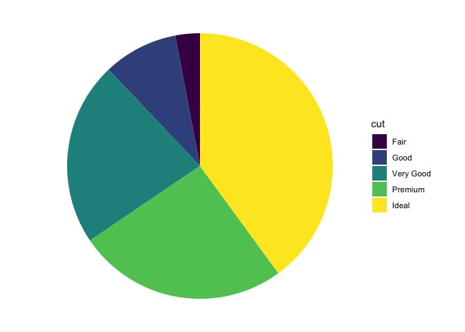

<!-- README.md is generated from README.Rmd. Please edit that file -->

# ggpie 🦄

<!-- badges: start -->

<!-- badges: end -->

The goal of ggpie is to … 🦄

``` r
ggpie(diamonds) + 
  aes(fill = cut) + 
  geom_wedges()
```

### Alternative without ggpie

We’re looking at a geom\_bar analogue, but it might be nice to do a
geom\_col too, where you have the counts yourself.

``` r
library(tidyverse)
#> ── Attaching core tidyverse packages ─────────────────── tidyverse 2.0.0.9000 ──
#> ✔ dplyr     1.1.0     ✔ readr     2.1.4
#> ✔ forcats   1.0.0     ✔ stringr   1.5.0
#> ✔ ggplot2   3.4.4     ✔ tibble    3.2.1
#> ✔ lubridate 1.9.2     ✔ tidyr     1.3.0
#> ✔ purrr     1.0.1     
#> ── Conflicts ────────────────────────────────────────── tidyverse_conflicts() ──
#> ✖ dplyr::filter() masks stats::filter()
#> ✖ dplyr::lag()    masks stats::lag()
#> ℹ Use the conflicted package (<http://conflicted.r-lib.org/>) to force all conflicts to become errors
diamonds %>%
ggplot() + 
  aes(x = "all", fill = cut) + 
  geom_bar() + 
  coord_polar(theta = "y") + 
  theme_void()
```


# Developing the new API.

``` r
defaults_pie <- function(){
  
  list(aes(x = "all"),
  coord_polar(theta = "y"),
  theme_void()
  )
  
}

ggpie <- function(data){
  
  ggplot(data = data) + 
  defaults_pie()
  
  
}

# just aliasing to be nice to ourselves
geom_wedge <- function(...){
  
  geom_bar(...)
  
}
```

## Test it out

``` r
ggpie(diamonds) + 
  aes(fill = cut) +
  geom_wedge() 
```



# Part II. Packaging and documentation 🚧 ✅

## Phase 1. Minimal working package

### Created files for package archetecture with `devtools::create(".")` ✅

### Moved functions R folder? ✅

``` r
knitr::knit_code$get() |> names()
#>  [1] "unnamed-chunk-1"           "unnamed-chunk-2"          
#>  [3] "unnamed-chunk-3"           "pie_functions"            
#>  [5] "unnamed-chunk-4"           "unnamed-chunk-5"          
#>  [7] "unnamed-chunk-6"           "unnamed-chunk-7"          
#>  [9] "unnamed-chunk-8"           "unnamed-chunk-9"          
#> [11] "unnamed-chunk-10"          "unnamed-chunk-11"         
#> [13] "test_calc_frequency_works" "unnamed-chunk-12"         
#> [15] "unnamed-chunk-13"          "unnamed-chunk-14"         
#> [17] "unnamed-chunk-15"
```

Use new {readme2pkg} function to do this from readme…

``` r
readme2pkg::chunk_to_r("pie_functions")
```

### Added roxygen skeleton? 🚧

Use a roxygen skeleton for auto documentation and making sure proposed
functions are *exported*.

### Managed dependencies ? 🚧

Package dependencies managed, i.e. `depend::function()` in proposed
functions and declared in the DESCRIPTION

``` r
usethis::use_package("ggplot2")
#> ✔ Setting active project to '/Users/evangelinereynolds/Google Drive/r_packages/ggpie'
#> ✔ Adding 'ggplot2' to Imports field in DESCRIPTION
#> • Refer to functions with `ggplot2::fun()`
```

### Chosen a license? ✅

``` r
usethis::use_mit_license()
```

### Run `devtools::check()` and addressed errors? 🚧

``` r
devtools::check(pkg = ".")
#> ℹ Updating ggpie documentation
#> ℹ Loading ggpie
#> Error: R CMD check found WARNINGs
```

### Build package 🚧

``` r
devtools::build()
#> ── R CMD build ─────────────────────────────────────────────────────────────────
#> * checking for file ‘/Users/evangelinereynolds/Google Drive/r_packages/ggpie/DESCRIPTION’ ... OK
#> * preparing ‘ggpie’:
#> * checking DESCRIPTION meta-information ... OK
#> * checking for LF line-endings in source and make files and shell scripts
#> * checking for empty or unneeded directories
#> Removed empty directory ‘ggpie/R’
#> * building ‘ggpie_0.0.0.9000.tar.gz’
#> [1] "/Users/evangelinereynolds/Google Drive/r_packages/ggpie_0.0.0.9000.tar.gz"
```

You need to do this before library(mynewpackage) will work.

### Make aspirational part of readme real. 🚧

At this point, you could change eval chunk options to TRUE. You can
remove the 🦄 emoji and perhaps replace it with construction site if you
are still uncertain of the API, and want to highlight that it is subject
to change.

### Add lifecycle badge (experimental)✅

``` r
usethis::use_lifecycle_badge("experimental")
#> ✔ Adding Lifecycle: experimental badge to 'README.Rmd'
#> • Re-knit 'README.Rmd' with `devtools::build_readme()`
```

## Phase 2: Listen & iterate 🚧

Try to get feedback from experts on API, implementation, default
decisions. Is there already work that solves this problem?

## Phase 3: Let thinggs settle

### Settled on examples. Put them in the roxygen skeleton and readme. 🚧

### Written formal tests of functions? 🚧

That would look like this…

``` r
library(testthat)

test_that("calc frequency works", {
  expect_equal(calc_frequency("A", 0), 440)
  expect_equal(calc_frequency("A", -1), 220)
  
})
```

``` r
readme2pkg::chunk_to_tests_testthat("test_calc_frequency_works")
```

### Have you worked added a description and author information in the DESCRIPTION file? 🚧

### Addressed *all* notes, warnings and errors. 🚧

## Promote to wider audience…

### Package website built? 🚧

### Package website deployed? 🚧

## Phase 3: Harden/commit

### Submit to CRAN? Or don’t. 🚧

# Appendix: Reports, Environment

## Description file extract

## Environment

Here I just want to print the packages and the versions

``` r
all <- sessionInfo() |> print() |> capture.output()
all[11:17]
#> [1] ""                                                                         
#> [2] "attached base packages:"                                                  
#> [3] "[1] stats     graphics  grDevices utils     datasets  methods   base     "
#> [4] ""                                                                         
#> [5] "other attached packages:"                                                 
#> [6] " [1] ggpie_0.0.0.9000     lubridate_1.9.2      forcats_1.0.0       "      
#> [7] " [4] stringr_1.5.0        dplyr_1.1.0          purrr_1.0.1         "
```

## `devtools::check()` report

``` r
devtools::check(pkg = ".")
#> ℹ Updating ggpie documentation
#> ℹ Loading ggpie
#> Error: R CMD check found WARNINGs
```
