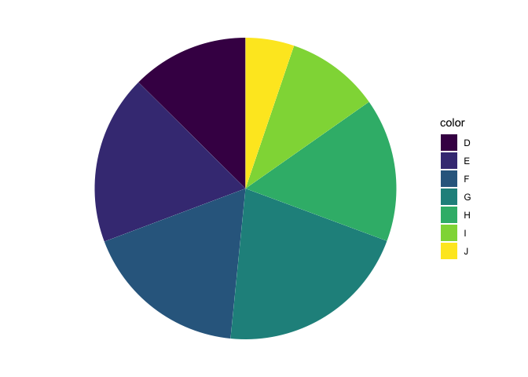
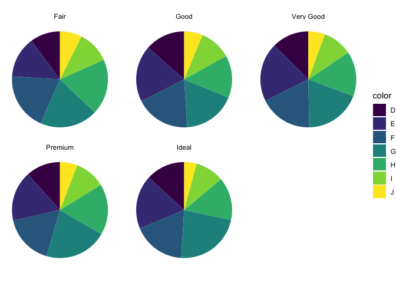
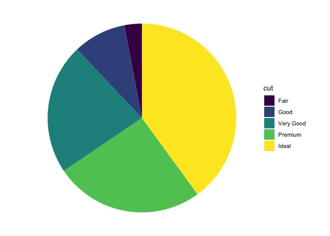
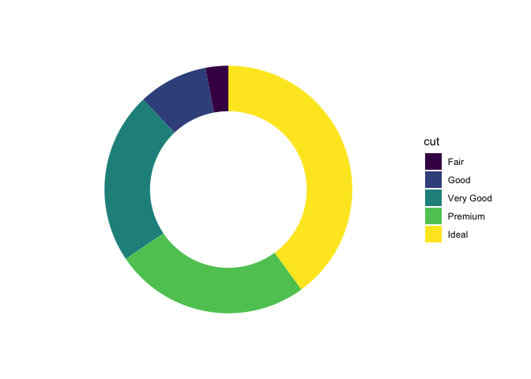

<!-- README.md is generated from README.Rmd. Please edit that file -->

# ggpie 🦄 (is mostly mythical), probably changing to ggwedge

<!-- badges: start -->

[](https://lifecycle.r-lib.org/articles/stages.html#experimental)
<!-- badges: end -->

The goal of ggpie is to allow this interface:

``` r
library(ggplot2)
library(ggpie)

ggpie(diamonds) + 
  aes(fill = color) + 
  geom_wedge() 
```



``` r

last_plot() + 
  facet_wrap(facets = vars(cut))
```



Observations: the `ggplot()` function start point has a particular set
of defaults that might not be the best suited for final plot.

Assertion: other defaults can be bundled up and serve as
grammatically-equivalent alternative start points.

### Alternative without ggpie

We’re looking at a geom\_bar analogue, but it might be nice to do a
geom\_col too, where you have the counts yourself.

``` r
library(tidyverse)

diamonds %>%
ggplot() + 
  aes(x = 0, fill = cut) + 
  geom_bar(position = "fill") + 
  coord_polar(theta = "y") + 
  theme_void() + 
  stat_count(position = "fill", 
             geom = "text", 
             color = "white",
             aes(label = after_stat(count*100/sum(count)) |> 
                   round(1) |> paste0("%")))
```


``` r


ggtrace::layer_after_stat(i = 2, verbose = T)
#> ✔ Executed `ggtrace_inspect_return(last_plot(), ggplot2:::Layer$compute_statistic, cond = 2L)`
#> # A tibble: 5 × 8
#>   count  prop     x width flipped_aes fill      PANEL group
#>   <dbl> <dbl> <dbl> <dbl> <lgl>       <ord>     <fct> <int>
#> 1  1610     1     0   0.9 FALSE       Fair      1         1
#> 2  4906     1     0   0.9 FALSE       Good      1         2
#> 3 12082     1     0   0.9 FALSE       Very Good 1         3
#> 4 13791     1     0   0.9 FALSE       Premium   1         4
#> 5 21551     1     0   0.9 FALSE       Ideal     1         5
ggtrace::layer_after_scale(i = 2, verbose = T) %>% data.frame()
#> ✔ Executed `ggtrace_inspect_return(last_plot(), ggplot2:::Layer$compute_geom_2, cond = 2L)`
#>        fill label         y count prop x width flipped_aes PANEL group
#> 1 #440154FF    3% 1.0000000  1610    1 0   0.9       FALSE     1     1
#> 2 #3B528BFF  9.1% 0.9701520  4906    1 0   0.9       FALSE     1     2
#> 3 #21908CFF 22.4% 0.8791991 12082    1 0   0.9       FALSE     1     3
#> 4 #5DC863FF 25.6% 0.6552095 13791    1 0   0.9       FALSE     1     4
#> 5 #FDE725FF   40% 0.3995365 21551    1 0   0.9       FALSE     1     5
#>        ymax xmin xmax      ymin colour size angle hjust vjust alpha family
#> 1 1.0000000    0    0 0.9701520  white 3.88     0   0.5   0.5    NA       
#> 2 0.9701520    0    0 0.8791991  white 3.88     0   0.5   0.5    NA       
#> 3 0.8791991    0    0 0.6552095  white 3.88     0   0.5   0.5    NA       
#> 4 0.6552095    0    0 0.3995365  white 3.88     0   0.5   0.5    NA       
#> 5 0.3995365    0    0 0.0000000  white 3.88     0   0.5   0.5    NA       
#>   fontface lineheight
#> 1        1        1.2
#> 2        1        1.2
#> 3        1        1.2
#> 4        1        1.2
#> 5        1        1.2
```

``` r
last_plot() + 
    stat_count(position = "fill", 
             geom = "text", 
             color = "white",
             aes(label = after_stat(count*100/sum(count)) |> 
                   round(1) |> paste0("%"),
                 y = after_scale((ymin + ymax)/2)))
#> Error in `stat_count()`:
#> ! Problem while setting up geom.
#> ℹ Error occurred in the 3rd layer.
#> Caused by error in `compute_geom_1()`:
#> ! `geom_text()` requires the following missing aesthetics: y
```

# Developing the new API.

``` r
#' Title
#'
#' @return
#' @export
#'
#' @examples
defaults_pie <- function(...){
  
  list(
    ggplot2::coord_polar(theta = "y", ...),
    ggplot2::theme_void(),
    ggplot2::aes(x = 0) # hacky; grammar problem
  )
  
}

#' Title
#'
#' @param data 
#'
#' @return
#' @export
#'
#' @examples
ggpie <- function(data){
  
  ggplot2::ggplot(data = data) + 
  defaults_pie()
  
}


# just aliasing to be nice to ourselves
# probably a better way 
# is doing more re-writing so that x is not a required aesthetic
#' Title
#'
#' @param ... 
#'
#' @return
#' @export
#'
#' @examples
geom_wedge <- function(...){
  
  ggplot2::geom_bar(position = "fill", ...)
  
}


# some very preliminary and messy ideas for new Stat Wedge approach
# but wondering if this is worth it.  
# I think it could be if geom is used with ggplot() start point.
# StatWedge <- ggproto(`_class` = StatCount2, 
#                      `_inherit` = ggplot2::Stat,
#                      compute_group )
# 
# ggplot2::StatCount$compute_group %>% 
#   mutate(x)
# 
# stat_count

# geom_wedge <- function (mapping = NULL, data = NULL, geom = "bar", 
#                         position = "fill", 
#                         ..., width = NULL, na.rm = FALSE, 
#                         orientation = NA, show.legend = NA, 
#                         inherit.aes = TRUE) 
# {
#     params <- list2(na.rm = na.rm, orientation = orientation, 
#         width = width, ...)
#     layer(data = data, mapping = mapping, stat = StatCount, geom = geom, 
#         position = position, show.legend = show.legend, inherit.aes = inherit.aes, 
#         params = params)
# }
```

## Test it out

``` r
ggpie(diamonds) + 
  aes(fill = cut) +
  geom_wedge() 
```



``` r

# a ggdonut() function could also be written
ggpie(diamonds) + 
  aes(fill = cut) +
  geom_wedge() +
  xlim(-2, 1)
```



# Part II. Packaging and documentation 🚧 ✅

## Phase 1. Minimal working package

### Created files for package archetecture with `devtools::create(".")` ✅

### Moved functions R folder? ✅

``` r
knitr::knit_code$get() |> names()
#>  [1] "unnamed-chunk-1"           "unnamed-chunk-2"          
#>  [3] "unnamed-chunk-3"           "unnamed-chunk-4"          
#>  [5] "pie_functions"             "unnamed-chunk-5"          
#>  [7] "unnamed-chunk-6"           "unnamed-chunk-7"          
#>  [9] "pkg_dependencies"          "pkg_license"              
#> [11] "pkg_check"                 "pkg_build"                
#> [13] "pkg_lifecycle_badge"       "test_calc_frequency_works"
#> [15] "send_tests"                "unnamed-chunk-8"          
#> [17] "session_pkgs"              "report_check"
```

Use new {readme2pkg} function to do this from readme… ✅

``` r
readme2pkg::chunk_to_r("pie_functions")
```

### Added roxygen skeleton? ✅

Use a roxygen skeleton for auto documentation and making sure proposed
functions are *exported*.

### Managed dependencies ? ✅

Package dependencies managed, i.e. `depend::function()` in proposed
functions and declared in the DESCRIPTION

``` r
usethis::use_package("ggplot2")
#> ✔ Setting active project to '/Users/evangelinereynolds/Google Drive/r_packages/ggpie'
#> • Refer to functions with `ggplot2::fun()`
```

### Chosen a license? ✅

``` r
usethis::use_mit_license()
```

### Run `devtools::check()` and addressed errors? 🚧

``` r
devtools::check(pkg = ".")
#> ℹ Updating ggpie documentation
#> ℹ Loading ggpie
#> Warning: ── Conflicts ──────────────────────────────────────────────── ggpie conflicts
#> ──
#> ✖ `defaults_pie` masks `ggpie::defaults_pie()`.
#> ✖ `geom_wedge` masks `ggpie::geom_wedge()`.
#> ✖ `ggpie` masks `ggpie::ggpie()`.
#> ℹ Did you accidentally source a file rather than using `load_all()`?
#>   Run `rm(list = c("defaults_pie", "geom_wedge", "ggpie"))` to remove the
#>   conflicts.
#> Warning: [pie_functions.R:3] @return requires a value
#> Warning: [pie_functions.R:6] @examples requires a value
#> Warning: [pie_functions.R:21] @return requires a value
#> Warning: [pie_functions.R:24] @examples requires a value
#> Warning: [pie_functions.R:40] @return requires a value
#> Warning: [pie_functions.R:43] @examples requires a value
#> Error: R CMD check found WARNINGs
```

### Build package 🚧

``` r
devtools::build()
#> ── R CMD build ─────────────────────────────────────────────────────────────────
#> * checking for file ‘/Users/evangelinereynolds/Google Drive/r_packages/ggpie/DESCRIPTION’ ... OK
#> * preparing ‘ggpie’:
#> * checking DESCRIPTION meta-information ... OK
#> * checking for LF line-endings in source and make files and shell scripts
#> * checking for empty or unneeded directories
#> * building ‘ggpie_0.0.0.9000.tar.gz’
#> [1] "/Users/evangelinereynolds/Google Drive/r_packages/ggpie_0.0.0.9000.tar.gz"
```

You need to do this before library(mynewpackage) will work.

### Make aspirational part of readme real. 🚧

At this point, you could change eval chunk options to TRUE. You can
remove the 🦄 emoji and perhaps replace it with construction site if you
are still uncertain of the API, and want to highlight that it is subject
to change.

### Add lifecycle badge (experimental)✅

``` r
usethis::use_lifecycle_badge("experimental")
```

## Phase 2: Listen & iterate 🚧

Try to get feedback from experts on API, implementation, default
decisions. Is there already work that solves this problem?

## Phase 3: Let thinggs settle

### Settled on examples. Put them in the roxygen skeleton and readme. 🚧

### Written formal tests of functions? 🚧

That would look like this…

``` r
library(testthat)

test_that("calc frequency works", {
  expect_equal(calc_frequency("A", 0), 440)
  expect_equal(calc_frequency("A", -1), 220)
})
```

``` r
readme2pkg::chunk_to_tests_testthat("test_calc_frequency_works")
```

### Have you worked added a description and author information in the DESCRIPTION file? 🚧

### Addressed *all* notes, warnings and errors. 🚧

## Promote to wider audience…

### Package website built? 🚧

### Package website deployed? 🚧

## Phase 3: Harden/commit

### Submit to CRAN? Or don’t. 🚧

# Appendix: Reports, Environment

## Description file extract

## Environment

Here I just want to print the packages and the versions

``` r
all <- sessionInfo() |> print() |> capture.output()
all[11:17]
#> [1] ""                                                                         
#> [2] "attached base packages:"                                                  
#> [3] "[1] stats     graphics  grDevices utils     datasets  methods   base     "
#> [4] ""                                                                         
#> [5] "other attached packages:"                                                 
#> [6] " [1] ggpie_0.0.0.9000     lubridate_1.9.2      forcats_1.0.0       "      
#> [7] " [4] stringr_1.5.0        dplyr_1.1.0          purrr_1.0.1         "
```

## `devtools::check()` report

``` r
devtools::check(pkg = ".")
#> ℹ Updating ggpie documentation
#> ℹ Loading ggpie
#> Error: R CMD check found WARNINGs
```
